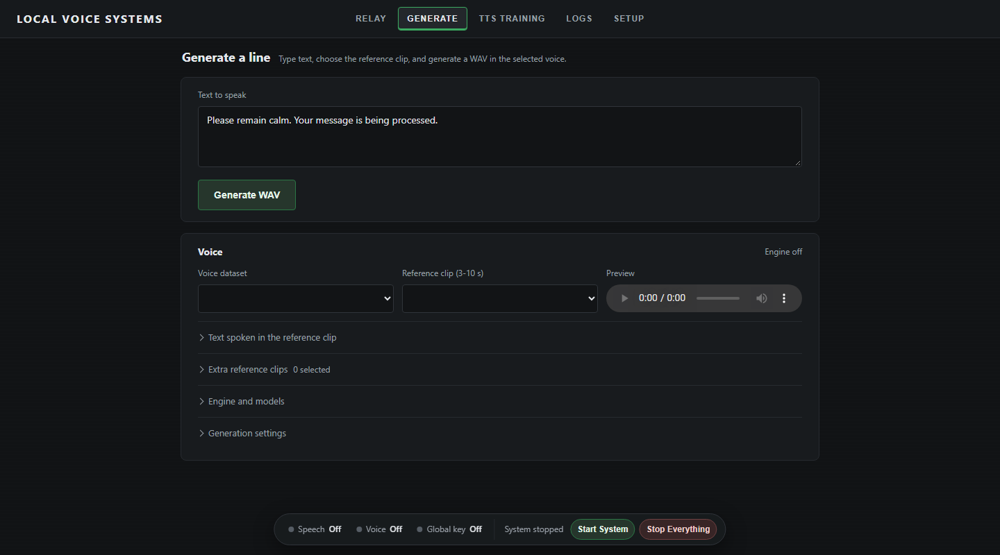

# Local Voice Systems

Speak or type, then hear the words in a reference voice. Runs locally after model downloads.



Requires **Windows 10/11 x64 + WSL2**, Python 3.12, FFmpeg on PATH, and Chrome or Edge.
The dashboard does not support native Linux, macOS, or Windows ARM. CPU mode works but is slow.

## Install

Install [Python 3.12](https://www.python.org/downloads/windows/), [Git](https://git-scm.com/downloads/win), and [FFmpeg](https://ffmpeg.org/download.html) on Windows.
For NVIDIA, install the [Windows driver](https://www.nvidia.com/Download/index.aspx). WSL uses it; do not install a Linux GPU driver.

In administrator PowerShell:

```text
wsl --install -d Ubuntu-24.04
wsl --update
```

Restart if prompted. Open Ubuntu once and create your Linux user.
For NVIDIA, `/usr/lib/wsl/lib/nvidia-smi` inside Ubuntu must list your card ([WSL requirements](https://docs.nvidia.com/cuda/wsl-user-guide/index.html)).

### Engine

With an existing GPT-SoVITS v2Pro install, skip to [Dashboard](#dashboard).
Install [Miniforge for Linux](https://github.com/conda-forge/miniforge#install) inside Ubuntu, then reopen Ubuntu.
Choose your values below. `build` is used in the commands; the other two go in `config.json`.

| Hardware | `build` | `tts_device` | `tts_precision` |
| --- | --- | --- | --- |
| RTX 20/30/40/50 | `cu128` | `cuda` | `fp16` |
| GTX 16 | `cu128` | `cuda` | `fp32` |
| GTX 10, Pascal/Volta | `cu126` | `cuda` | `fp32` |
| Older NVIDIA, Intel, or no GPU | `cpu` | `cpu` | `fp32` |

Run in Ubuntu. The upstream installer downloads the models and dependencies.

```text
sudo apt update
sudo apt install -y build-essential git wget
conda create -y -n gsv python=3.10 uv
conda activate gsv
git clone https://github.com/RVC-Boss/GPT-SoVITS.git ~/GPT-SoVITS
cd ~/GPT-SoVITS
git checkout 48b1a0169a28582a8984402f82cf438d3bfa6aca
build=cu128
uv pip install "torch==2.11.0+$build" "torchaudio==2.11.0+$build" torchcodec==0.11.1 --index-url "https://download.pytorch.org/whl/$build"
printf 'torch==2.11.0\ntorchaudio==2.11.0\ntorchcodec==0.11.1\n' > voice-constraints.txt
CONDA_PINNED_PACKAGES='ffmpeg>=6,<9' PIP_CONSTRAINT="$PWD/voice-constraints.txt" WORKFLOW=true bash install.sh --device "${build^^}" --source HF
```

These pins keep PyTorch, torchaudio, and FFmpeg compatible.
For AMD, follow [GPT-SoVITS's ROCm setup](https://github.com/RVC-Boss/GPT-SoVITS), then use `tts_device: "cuda"`.

### Dashboard

In a normal Windows PowerShell:

```text
git clone https://github.com/alexandru-tanul/local-voice-systems.git
cd local-voice-systems
Copy-Item config.example.json config.json
```

Edit `config.json`: replace `YOUR_WSL_USER` in the three paths and choose the device and precision from the table.
For an existing engine, keep its paths. Restart the dashboard after config edits.

Optional keys, for when a port is taken or you want a different setting:

| Key | Default | Use |
| --- | --- | --- |
| `dashboard_port` | `8790` | Port of the dashboard page |
| `asr_port` | `8792` | Port of speech recognition |
| `tts_port` | `9880` | Port of the voice engine in WSL |
| `asr_model` | `base.en` | [faster-whisper](https://github.com/SYSTRAN/faster-whisper) model, for example `small.en` for better accuracy |
| `asr_model_dir` | `.cache/faster-whisper` | Download folder of the speech model |
| `cache_dir`, `tmp_dir` | `.cache`, `.cache/tmp` | Download caches and temporary files |
| `dashboard_python` | `relay_env` | Python that runs the dashboard |

Run `Setup-Relay-Env.bat`, then `Launch-Voice-Dashboard.bat`. Open **Setup** to check the selected device.
Use `Stop-Voice-Dashboard.bat` to stop it. Speech recognition uses CPU and downloads its model on first use.

## Use

1. On **TTS Training**, create a dataset with a clear 3 to 10 second clip and its exact transcript. Press **Sync & Prepare**.
2. On **Generate**, choose the dataset, reference clip, and pretrained `s1v3.ckpt` / `s2Gv2Pro.pth` models. Enter text and generate audio.
3. On **Relay**, press **Start System**, hold push-to-talk, speak, then release. Choose audio output in **Settings**.

To train a voice, add more clips, prepare the dataset, then train SoVITS and GPT with batch size 1.
Use [VB-CABLE](https://vb-audio.com/Cable/) to send the generated voice to another app.

## Fix

- GPU error: check the Windows driver and build. To use CPU, set `tts_device` to `cpu`.
- Noise or NaNs: use `tts_precision: "fp32"`. Out of memory: stop other GPU jobs, reduce batch size, or use CPU.
- Upload fails: run `ffmpeg -version` in Windows. Missing WSL files: check the paths in `config.json`.

## Check

```text
python -m unittest discover -s tests
```

CI checks Windows and Linux. CPU synthesis was tested in Ubuntu; Windows GPU execution remains unverified.

[GPT-SoVITS](https://github.com/RVC-Boss/GPT-SoVITS) · [faster-whisper](https://github.com/SYSTRAN/faster-whisper) · [MIT](LICENSE)
